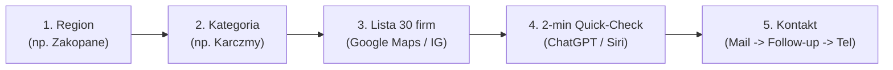

# Playbook Outbound: Branża Turystyczna i Górska
## NotASlop — System Pozyskiwania Klientów dla Business Development

Ten dokument to kompletny, gotowy do natychmiastowego wdrożenia przewodnik operacyjny dla roli:
**Outbound / Business Development – Branża Turystyczna i Górska**.

---

## 1. Strategia i Złota Zasada: Nie sprzedajemy „GEO”

> [!IMPORTANT]
> **Właściciel pensjonatu, szkółki narciarskiej czy karczmy nie kupuje „GEO”, „modeli LLM” ani „znaczników Schema”.**
> Kupuje **pełne obłożenie w sezonie, wyższe rachunki i turystów, którzy nie pójdą do lokalu obok**.

### Czego kategorycznie NIE mówimy:
* ❌ *„Oferujemy usługi Generative Engine Optimization (GEO)”*
* ❌ *„Optymalizujemy znaczniki Schema.org i dane strukturalne JSON-LD”*
* ❌ *„Budujemy autorytet w wektorowych bazach wiedzy modeli AI”*

### Co mówimy (język zysku i straty klienta):
* ✅ *„Sprawdziliśmy, kogo ChatGPT i Siri polecają turystom pytającym o nocleg / obiad po nartach w [Miejscowość]. Państwa obiekt w ogóle się tam nie pojawia, a polecany jest [Konkurent A] i [Konkurent B].”*
* ✅ *„Coraz więcej gości (zwłaszcza użytkowników iPhone'ów i osób planujących wyjazdy) pyta wprost asystenta w telefonie: 'gdzie najlepiej zjeść' albo 'gdzie wypożyczyć narty dla dzieci'. Sprawiamy, że to Wasz obiekt jest wskazywany z nazwy na pierwszym miejscu.”*
* ✅ *„W [Miejscowość] współpracujemy tylko z 1–2 obiektami w danej kategorii, aby zapewnić im wyłączność i nie tworzyć konfliktu interesów.”*

---

## 2. Segmentacja i Katalog Zapytań AI

Każda kategoria biznesu ma krytyczne zapytania, które turyści wpisują lub dyktują asystentom AI:

| Kategoria | Przykładowe zapytania turystów w AI | Wartość biznesowa dla klienta |
| :--- | :--- | :--- |
| **Hotele, domki, pensjonaty** | • *„Gdzie najlepiej zatrzymać się w Zakopanem zimą dla rodziny z dziećmi?”*<br>• *„Poleć domki z balią i widokiem na Tatry w Kościelisku”*<br>• *„Hotel blisko stoku Kotelnica Białka Tatrzańska ze SPA”* | Rezerwacja pobytu (2 000 – 12 000 zł) |
| **Karczmy i restauracje** | • *„Najlepsza karczma z tradycyjnym jedzeniem w Zakopanem”*<br>• *„Gdzie zjeść dobry obiad po nartach w Szczyrku?”*<br>• *„Klimatyczna restauracja z kominkiem w Karpaczu”* | Rachunek za stolik (150 – 500 zł), stały obrót |
| **Wypożyczalnie sprzętu** | • *„Gdzie najlepiej wypożyczyć narty i buty w Białce Tatrzańskiej?”*<br>• *„Wypożyczalnia snowboardu blisko wyciągu w Szklarskiej Porębie”* | Sprzęt dla grup i rodzin (300 – 1 500 zł) |
| **Szkółki narciarskie** | • *„Poleć dobrą szkółkę narciarską dla początkujących dzieci w Wiśle”*<br>• *„Najlepsi instruktorzy snowboardu w Krynicy-Zdrój”* | Pakiety lekcji (400 – 2 000 zł) |
| **Atrakcje, kuligi, termy** | • *„Gdzie zamówić prawdziwy kulig z ogniskiem w Zakopanem?”*<br>• *„Najlepsze termy i baseny termalne na Podhalu zimą”*<br>• *„Wypożyczalnia skuterów śnieżnych w Tatrach opinie”* | Bilety grupowe, marża (500 – 3 000 zł) |

---

## 3. Prosty 5-Krokowy System Pracy Dziennej



### Krok 1: Wybór regionu (Działanie klastrami)
1. **Tatry & Podhale**: Zakopane, Białka Tatrzańska, Bukowina Tatrzańska, Kościelisko, Poronin, Nowy Targ.
2. **Beskidy**: Szczyrk, Wisła, Ustroń, Koniaków, Brenna.
3. **Karkonosze & Izery**: Karpacz, Szklarska Poręba, Jelenia Góra, Świeradów-Zdrój.
4. **Kotlina Kłodzka & Sudety**: Zieleniec, Czarna Góra, Polanica-Zdrój, Duszniki-Zdrój.
5. **Beskid Sądecki & Bieszczady**: Krynica-Zdrój, Szczawnica, Ustrzyki Dolne.

### Krok 2: Wybór kategorii
Nie mieszamy branż w jednym bloku pracy:
* **Poniedziałek**: Hotele, apartamenty i domki.
* **Wtorek**: Karczmy, restauracje i lokale przy stoku.
* **Środa**: Wypożyczalnie nart i snowboardu.
* **Czwartek**: Szkółki narciarskie i instruktorzy.
* **Piątek**: Atrakcje, kuligi, termy, skutery.

### Krok 3: Szybka lista 30–50 firm
* Otwórz Google Maps i wpisz np. *„wypożyczalnia nart Białka Tatrzańska”*.
* Szukaj podmiotów z oceną **4.3+** i co najmniej 30–50 opiniami (to firmy stabilne, z budżetem, którym zależy na reputacji).
* Zanotuj: Nazwa, adres www, telefon, bezpośredni e-mail, imię właściciela/menedżera.

### Krok 4: 2-minutowy Quick-Check (Twardy haczyk)
Przed wysłaniem wiadomości otwieramy [ChatGPT](https://chatgpt.com) lub [Perplexity](https://www.perplexity.ai):
1. Wpisujemy: *„Poleć 3 najlepsze [kategoria] w [miejscowość] na wyjazd zimowy”*.
2. Sprawdzamy wyniki.
3. Jeśli badanej firmy **NIE MA**:
   > Spisujemy nazwy 2 firm, które ChatGPT polecił. To nasz twardy dowód w mailu.

---

## 4. Szablony Cold Email (Otwierające rozmowę)

### Szablon A: Hotele, Pensjonaty, Domki
**Temat**: Kogo ChatGPT poleca turystom w [Miejscowość]? ([Nazwa Obiektu])

> Dzień dobry Panie/Pani [Imię / Właścicielu],
>
> Przygotowując analizę przed zbliżającym się sezonem zimowym w [Miejscowość], sprawdziliśmy, jakie obiekty noclegowe rekomendują dziś asystenci AI (ChatGPT, Siri i Apple Maps), gdy turyści planują pobyt.
>
> Na zapytanie: *„Poleć sprawdzony hotel/domki blisko stoku w [Miejscowość] dla rodziny”*, sztuczna inteligencja poleca [Nazwa Konkurenta A] oraz [Nazwa Konkurenta B].
>
> Państwa obiekt w tych rekomendacjach w ogóle się nie pojawia — mimo świetnych ocen i wyrobionej renomy w Google.
>
> W NotASlop dbamy o to, aby to konkretne hotele i pensjonaty były bezpośrednio wskazywane przez ChatGPT i asystentów głosowych turystom decydującym o rezerwacji.
>
> Przygotowaliśmy krótkie, bezpłatne zestawienie pokazujące, jak [Nazwa Obiektu] wypada na tle konkurencji w rekomendacjach AI. Czy mogę przesłać to 2-stronicowe podsumowanie tutaj na maila?
>
> Pozdrawiam serdecznie,  
> **[Imię i Nazwisko]**  
> Business Development · NotASlop  
> Tel: [Numer Telefonu] | notaslop.com

---

### Szablon B: Restauracje i Karczmy przy stokach
**Temat**: Pytanie o rekomendacje obiadowe po nartach w [Miejscowość]

> Dzień dobry,
>
> Przed nadchodzącym sezonem narciarskim coraz więcej gości zamiast wpisywać frazy w Google, pyta wprost asystenta w telefonie: *„Gdzie zjeść najlepszy obiad po nartach w [Miejscowość]?”*.
>
> Przetestowaliśmy to zapytanie dla Waszej okolicy. ChatGPT i Siri jako pierwszy wybór wskazują lokale [Konkurent 1] oraz [Konkurent 2]. Państwa restauracja w ogóle nie jest brana pod uwagę w tych podpowiedziach.
>
> Sprawiamy, że wybrane lokale gastronomiczne stają się rekomendacją #1 asystentów AI w danym kurorcie. Z zasady współpracujemy z maksymalnie 2 lokalami w jednej miejscowości, aby nie tworzyć konfliktu interesów.
>
> Czy byłaby przestrzeń na 5-minutową rozmowę telefoniczną w tym tygodniu, żebym pokazał, jak skierować tych gości do Waszego lokalu?
>
> Pozdrawiam,  
> **[Imię i Nazwisko]**  
> NotASlop · notaslop.com | Tel: [Numer Telefonu]

---

### Szablon C: Wypożyczalnie i Szkółki narciarskie
**Temat**: Rezerwacje sprzętu i instruktorów z ChatGPT w [Miejscowość]

> Cześć / Dzień dobry,
>
> Narciarze planujący wyjazdy na ferie już teraz pytają sztuczną inteligencję w telefonach: *„Gdzie w [Miejscowość] najlepiej wypożyczyć narty / znaleźć dobrego instruktora?”*.
>
> Zrobiliśmy szybki test dla Waszego rejonu — niestety algorytmy AI promują [Konkurent A], a o [Nazwa Wypożyczalni] milczą, mimo że macie świetną bazę i sprzęt.
>
> Pomagamy wypożyczalniom i szkółkom zająć pozycję #1 w odpowiedziach ChatGPT, Apple Maps i Siri dla turystów przyjeżdżających na stok.
>
> Jeśli zależy Wam na zdobyciu tych klientów przed konkurencją w tym sezonie, dajcie znać — podeślę bezpłatną analizę pokazującą, co trzeba uzupełnić.
>
> Dobrego dnia,  
> **[Imię i Nazwisko]**  
> NotASlop · Tel: [Numer Telefonu]

---

## 5. Sekwencja Follow-up

> [!TIP]
> **Aż 60–70% konwersji wynika z follow-upów.** Właściciele obiektów turystycznych są zabiegani i rzadko odpowiadają na pierwszą wiadomość.

### Follow-up 1 (Po 3 dniach):
*Wysyłany w tym samym wątku e-mail.*

> Dzień dobry Panie/Pani [Imię],
>
> Wiem, że przed sezonem pracy jest mnóstwo, więc krótko:
>
> Zrobiliśmy zrzut ekranu z odpowiedzi ChatGPT dla zapytania o polecane obiekty w [Miejscowość] — widać na nim dokładnie, jak turyści są obecnie kierowani do [Nazwa Konkurenta].
>
> Chętnie podeślę ten screen bez żadnych zobowiązań. Czy podesłać go na ten adres?
>
> Pozdrawiam,  
> **[Imię]**

### Follow-up 2 (Po kolejnych 4 dniach — Dźwignia Wyłączności):
*Wysyłany w tym samym wątku e-mail.*

> Dzień dobry Panie/Pani [Imię],
>
> W tym tygodniu zamykamy listę partnerów w [Miejscowość] w kategorii [Kategoria] — zależy nam na współpracy wyłącznie z jednym obiektem w tym rejonie, aby zapewnić mu pozycję #1 w rekomendacjach AI.
>
> Zanim odezwiemy się do kolejnego lokalu z zapytaniem o współpracę, wolałem upewnić się, czy temat jest dla Państwa interesujący?
>
> Jeśli nie — oczywiście rozumiem i nie będę więcej zawracać głowy.
>
> Pozdrawiam serdecznie,  
> **[Imię]**

---

## 6. Skrypt Telefoniczny (Cold Call & Po Mailu)

### Etap 1: Przejście przez recepcję
Recepcja ma nawyk mówienia: *„Proszę przesłać ofertę na maila”*.

* **Kumpel**: *„Dzień dobry, z tej strony [Imię] z NotASlop. Przygotowaliśmy dla Państwa właściciela krótką analizę odnośnie tego, kogo sztuczna inteligencja w telefonach poleca turystom szukającym noclegu w [Miejscowość]. Z kim z dyrekcji lub właścicieli mogę krótko porozmawiać, żeby wiedział, dlaczego konkurencyjny [Nazwa Konkurenta] wyświetla się przed Wami?”*
* *Gdy recepcja nalega na wysłanie na ogólnego maila:*  
  **Kumpel**: *„Jasne, wyślę, ale zależy mi, by trafiło to bezpośrednio do osoby decyzyjnej, a nie zginęło wśród zapytań o pokoje. Do kogo imiennie mogę zaadresować tę analizę?”*

### Etap 2: Rozmowa z właścicielem / dyrektorem (Hook w 30 sekund)

* **Kumpel**: *„Dzień dobry Panie [Imię]. Dzwonię krótko i w bardzo konkretnej sprawie związanej ze zbliżającym się sezonem zimowym w [Miejscowość]. Nazywam się [Imię] z NotASlop.*
  
  *Przeanalizowaliśmy zapytania turystów w ChatGPT i asystentach Apple. Gdy ktoś pyta o [najlepszy nocleg / obiad po nartach] w Waszej okolicy, sztuczna inteligencja poleca [Konkurent A] i [Konkurent B]. Państwa obiekt w ogóle się tam nie pojawia.*
  
  *Nie chcę Panu niczego sprzedawać przez telefon. Chcemy po prostu pokazać, jak to zmienić przed startem zimy. Mój wspólnik [Twoje Imię], który odpowiada u nas za technologię, może pokazać Panu podczas 15-minutowego spotkania online bezpłatny audyt i konkretne liczby.*
  
  *Czy pasowałby Panu czwartek o 11:00 czy raczej piątek rano?”*

### Reakcje na typowe obiekcje:
1. **„Mamy już agencję od SEO / social mediów”**:
   * *„Bardzo dobrze, to znaczy, że dbacie o promocję. SEO i social media są świetne, ale asystenci AI (ChatGPT, Siri) korzystają z zupełnie innych źródeł danych. Tradycyjne agencje w 95% przypadków w ogóle się tym nie zajmują. Warto poświęcić kwadrans, żeby zobaczyć tę różnicę.”*
2. **„Większość gości mamy z Bookingu”**:
   * *„Booking pobiera od Was 15–20% prowizji od każdej rezerwacji. Klienci z ChatGPT i Siri dzwonią bezpośrednio lub rezerwują przez Waszą stronę bez prowizji pośrednika. Już jedna dodatkowa rezerwacja bezpośrednia tygodniowo spłaca naszą współpracę.”*
3. **„Ile to kosztuje?”**:
   * *„Wycena zależy od obiektu, ale koszt zwraca się z reguły po 1-2 rezerwacjach w sezonie. Szczegóły i bezpłatną analizę pokaże Panu wspólnik na 15-minutowym spotkaniu — jeśli uzna Pan, że to nie dla Was, raport zostaje u Pana za darmo.”*

---

## 7. Podział Ról i Przekazanie Leada (Hand-Off)

```
[KUMPEL: Outbound & BD]              [TY: Założyciel / Head of Product]
- Wybór regionu i bazy                 - Przygotowanie pogłębionego audytu AI
- 2-min Quick-Check                    - Prowadzenie 15-min demo / rozmowy
- Wysłanie maili / telefon             - Prezentacja oferty z wyłącznością
- Kwalifikacja & umówienie terminu ──> - Zamknięcie umowy i wdrożenie GEO
```

### Karta przekazania leada (Wysyłana na Slack / WhatsApp):
```text
OBIEKT: Willa Pod Reglami (Zakopane)
OSOBA DECYZYJNA: Jan Kowalski (Właściciel)
TEL: 601 xxx xxx | EMAIL: biuro@willapodreglami.pl
MIEJSCOWOŚĆ / KATEGORIA: Zakopane · Noclegi / Apartamenty
HACZYK AI: W zapytaniu "rodzinne apartamenty Zakopane z widokiem" ChatGPT poleca Willę X i Rezydencję Y. Willi Pod Reglami brak.
TERMIN SPOTKANIA: Czwartek, godz. 11:30 (Google Meet / Telefon).
NOTATKI: Pan Jan narzeka na prowizje Bookingu. Bardzo zależy mu na rezerwacjach na ferie zimowe.
```

---

## 8. Struktura Arkusza Pipeline (Google Sheets / Notion)

| Kolumna | Opis | Przykład |
| :--- | :--- | :--- |
| **Nazwa firmy** | Pełna nazwa obiektu | Karczma u Bacy |
| **Kategoria** | Hotel / Karczma / Wypożyczalnia / Szkółka | Karczma |
| **Miejscowość** | Region / Miasto | Białka Tatrzańska |
| **Decydent** | Imię, nazwisko, stanowisko | Stanisław Bachleda (Właściciel) |
| **Kontakt** | Telefon i bezpośredni e-mail | 600 111 222 / biuro@ubacy.pl |
| **Prompt AI** | Przetestowane zapytanie | *„Najlepsza karczma po nartach Białka”* |
| **Konkurencja w AI** | Kto wygrywa w odpowiedziach | Karczma Litwinka, Baciarska |
| **Status** | Status w lejku | *Spotkanie umówione (Hand-off)* |
| **Data kontaktu** | Data ostatniej akcji | 2026-09-17 |
| **Następny krok** | Co i kiedy zrobić | Rozmowa wideo 19.09 godz. 11:00 |
